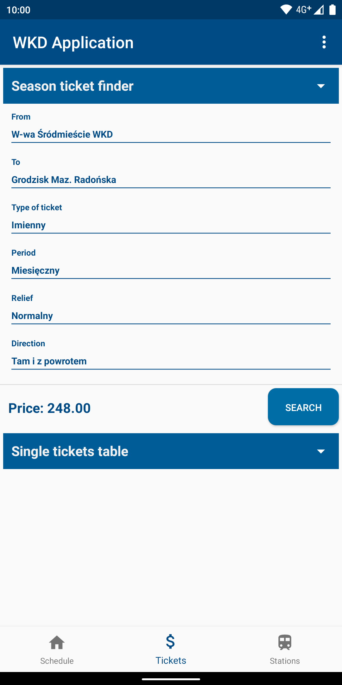

# WKD application
## CLOSED
WKD changed the API, so the app no longer receives JSON files. 

**WKD application** is a compact tool for passengers of
[Warszawska Kolej Dojazdowa](http://www.wkd.com.pl/) (eng. [Warsaw Commuter Railway](http://www.wkd.com.pl/en/) )
It is designed to help users in daily situations.

Latest version:
**3.2-alpha**

## Features
- Schedule tool (with whole route)

  
- Ticket finder (both season and single)

 
- Nearest station finder

 
- List of all stations (every station can be oppened in order to check the information)

 
- Settings (default stations in scheduler and default ticket relief)

## Installation
Just download the latest .apk file *(app-debugvX.X.X.apk, where X.X.X is the latest version)* from [Google Drive](https://drive.google.com/drive/folders/11cCk1WYLW4fcndNYn5KUOUNRMHgx0iKL?usp=sharing)
and install on your mobile device. Works only on **Android** devices with minimal version of **Android 8.0 (Oreo)**

## Known issues
- ~~Double Dialog error on some devices~~ solved thanks to tests by [amwms](https://github.com/amwms)
